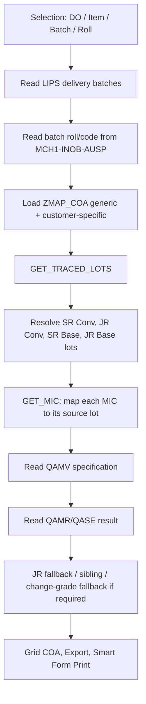

# Technical Specification — ZQMI_COA (Certificate of Analysis)

## 1. Identitas Dokumen

| Item | Nilai |
|---|---|
| Program utama | `ZQMI_COA` (`REPORT ZQMI_CERTIFICATE`) |
| Tujuan | Menampilkan, memilih, mengekspor, dan mencetak Certificate of Analysis (COA) berdasarkan Delivery Order (DO), item, batch, dan nomor roll. |
| Area | QM / SD / PP / Batch Management |
| TCODE terkait | `ZQM002` (transaksi COA), `ZQM003` (report/daftar COA), `ZMAP_COA` (maintenance mapping), `SE38`, `SE11`, `SE16N`, `QA03`, `SMARTFORMS` |
| Platform | SAP ECC 6.0 EHP6, NetWeaver/ABAP 7.31, Oracle |
| Include utama | `ZQMI_COA_TOP`, `ZQMI_COA_F01`, `ZQMI_COA_F02` |
| Sumber proses bisnis | `COA.md` |

## 2. Tujuan Bisnis

Program menghasilkan COA untuk batch yang dikirim ke customer. Setiap MIC (Master Inspection Characteristic) pada COA tidak selalu mengambil result dari inspection lot batch delivery. Sumber lot ditentukan oleh mapping proses pada `ZMAP_COA`, sehingga result dapat berasal dari tahap Base Film atau Converting, pada level Jumbo Roll (JR) maupun Slit Roll (SR).

Prinsip utamanya adalah:

1. Baca batch delivery yang relevan.
2. Tentukan daftar MIC yang harus tercetak berdasarkan material dan customer.
3. Trace batch ke empat kemungkinan sumber inspection lot.
4. Ambil specification dan result dari lot yang ditentukan mapping.
5. Jika lot/result tidak ada, gunakan fallback yang memang diperbolehkan oleh proses (change grade, sibling, atau average JR).
6. Sajikan hasil pada grid COA dan kirim data terpilih ke Smart Form saat Print.

## 3. Lingkup dan Batasan

### 3.1 Dalam lingkup

- Selection dan pembacaan delivery item/batch.
- Customer-specific COA mapping dengan fallback generic mapping.
- Trace `JR Base Film`, `SR Base Film`, `JR Converting`, dan `SR Converting`.
- Penanganan change grade/re-batching melalui `ZBATCHISTORY` dan movement PP.
- Penanganan SR/JR sibling.
- Pengambilan result average dan single-result, termasuk Barrier MVTR/OTR.
- Tampilkan Lower Limit, Upper Limit, Unit, Method, Inspection Lot, dan Value.
- Ekspor dan print COA.

### 3.2 Di luar lingkup

- Penciptaan atau perubahan inspection lot/QAMR/QASE.
- Perubahan master specification atau mapping langsung melalui tabel.
- Perubahan status Usage Decision (UD); program hanya membaca hasil QM untuk COA.
- Smart Form layout detail; Smart Form dipanggil oleh program tetapi layout dikelola melalui `SMARTFORMS`.

## 4. Struktur Teknis

```text
ZQMI_COA (report utama)
 ├─ ZQMI_COA_TOP  : deklarasi type, internal table, selection screen
 ├─ ZQMI_COA_F01  : ekstraksi data, mapping, trace lot, result, print/export
 └─ ZQMI_COA_F02  : Dynpro/table control, detail screen, command handling

Data master/transaksi
 ├─ LIKP/LIPS     : header dan item delivery
 ├─ MCH1/INOB/AUSP: batch dan characteristic batch (roll/code)
 ├─ ZMAP_COA      : mapping COA per material/customer/MIC
 ├─ QALS/QAMV     : inspection lot dan specification MIC
 ├─ QAMR/QASE     : result inspection average dan single-result
 ├─ MSEG/MKPF/AFPO: trace production order dan component consumption
 └─ ZBATCHISTORY  : relasi batch lama ↔ batch baru (change grade/re-batch)
```

## 5. Parameter Selection Screen

| Parameter | Tipe referensi | Fungsi |
|---|---|---|
| `P_CHARG` | `LIPS-CHARG` | Memilih batch delivery tertentu. |
| `P_ATWRT` | `AUSP-ATWRT` | Memilih berdasarkan nomor roll batch (`ZZNOMORROLL`). |
| `P_MATNR` | `LIPS-MATNR` | Membatasi material delivery. |
| `P_VBELN` | `LIPS-VBELN` | Nomor DO/delivery yang diproses. Ini parameter utama operasi COA. |
| `P_POSNR` | `LIPS-POSNR` | Membatasi item utama delivery. Secondary item yang memiliki `UECHA` ke item ini tetap ikut diproses. |

Program memperoleh daftar item category yang valid dari `ZMAP_TYPE` dengan `TYPE = 'ITEM CATEGORY'` dan `PROG = SY-CPROG`. Bila konfigurasi tidak ada, fallback item category adalah `ZB`.

## 6. Mapping COA (`ZMAP_COA`)

### 6.1 Kunci dan field bisnis

| Field | Peran |
|---|---|
| `MATNR` | Material yang dipetakan. |
| `MIC` | MIC yang wajib muncul pada COA. |
| `KUNNR` | Customer Number. Ini key sebenarnya; Customer Name hanya teks dari `KNA1` untuk tampilan maintenance. |
| `METHOD` | Metode pengujian yang ditampilkan pada COA. |
| `MAPPING` | Penentu sumber inspection lot. |
| `DELETION` | `X` berarti mapping tidak aktif dan tidak boleh dipakai. |

### 6.2 Prioritas generic vs customer-specific

Untuk setiap baris delivery, program mengambil `LIKP-KUNAG` sebagai customer sold-to. Lalu program membaca dua set mapping aktif (`DELETION NE 'X'`):

1. Generic: `MATNR = material` dan `KUNNR` kosong.
2. Customer-specific: `MATNR = material` dan `KUNNR = LIKP-KUNAG`.

Customer-specific tidak mengganti seluruh daftar generic secara buta. Penggabungannya dilakukan per MIC:

- Jika MIC customer-specific sama dengan MIC generic, field Method, Customer, dan Mapping dari customer-specific mengganti generic.
- Jika MIC hanya ada pada mapping customer-specific, MIC ditambahkan ke daftar.
- Bila customer-specific tidak aktif/tidak ada, generic mapping tetap dipakai.

Konsekuensi penting: mapping customer dengan `DELETION = 'X'` diperlakukan tidak ada; hasil COA akan fallback ke generic mapping. Ini adalah perilaku yang diharapkan.

### 6.3 Arti Mapping

| Nilai `ZMAP_COA-MAPPING` | Variable lot program | Sumber nilai |
|---|---|---|
| `JR Base Film` | `LOT_JR_BASE` | Lot JR proses Base Film. |
| `SR Base Film` | `LOT_SR_BASE` | Lot SR proses Base Film. |
| `JR Converting` | `LOT_JR_CONV` | Lot JR proses Converting. |
| `SR Converting` | `LOT_SR_CONV` | Lot SR proses Converting/delivery. |

Default defensif bila mapping tidak dikenali adalah `LOT_SR_CONV`; secara bisnis mapping baru harus tetap diberi salah satu dari empat nilai di atas.

## 7. Flow End-to-End



### 7.1 Pembacaan delivery dan batch

1. Bila nomor roll diisi, program mencari object batch classification di `AUSP` untuk characteristic `ZZNOMORROLL`, menerjemahkan object ke batch, kemudian mengambil item `LIPS`.
2. Bila nomor roll tidak diisi, program memilih `LIPS` dengan kombinasi DO, item, material, batch, dan item category yang valid.
3. Baris tanpa `LIPS-CHARG` dibuang karena COA harus dapat ditelusuri ke batch.
4. Program melakukan bulk-read `INOB` dan `AUSP` untuk mengambil:
   - `ZZNOMORROLL` → `NOMSR`.
   - `ZZCODE` → tipe/code batch (`ZZTYPE`).

Bulk read dilakukan agar query classification tidak diulang untuk setiap field batch.

## 8. Scenario Secondary Item

Dalam konteks program, secondary item adalah item `LIPS` yang menunjuk ke higher-level item melalui `LIPS-UECHA`.

- Jika user memilih `P_POSNR`, program membaca item yang `POSNR` sesuai pilihan.
- Program juga membaca secondary item yang `UECHA` sesuai item pilihan.
- Setelah data diambil, bila `UECHA` kosong maka program mengisinya dengan `POSNR` sendiri. Dengan demikian item utama dan item turunan memiliki grouping key yang konsisten.

Tujuannya adalah agar COA tidak kehilangan batch nyata yang berada pada subitem/secondary item ketika user menyeleksi item utama DO.

## 9. Trace Inspection Lot (`GET_TRACED_LOTS`)

### 9.1 Konsep dasar

Program harus membentuk empat lot berikut untuk batch delivery:

```text
JR Base Film → SR Base Film → JR Converting → SR Converting (batch delivery)
      │              │                │                  │
LOT_JR_BASE    LOT_SR_BASE       LOT_JR_CONV       LOT_SR_CONV
```

Jenis lot yang digunakan:

- Lot SR: `QALS-ART = 'Z04'`.
- Lot JR: `QALS-ART = 'Z02'` atau `QALS-ART = 'Z03'`.

### 9.2 Langkah trace normal

1. **SR Converting**
   - Cari `QALS` dengan batch delivery dan `ART = 'Z04'`.
   - Ini adalah lot paling dekat dengan delivery.

2. **JR Converting**
   - Normalisasi batch SR dengan `GET_ORIGINAL_BATCH`.
   - Panggil `ZQM_GET_BATCH_JR_BY_SR` untuk memperoleh JR induk.
   - Cari lot JR pada batch tersebut (`Z02`/`Z03`).

3. **SR Base Film**
   - Ambil production order dari batch JR Converting.
   - Ambil component batch yang benar dari order tersebut.
   - Untuk material SR tertentu, `MCH1-LICHA` digunakan jika tersedia sebagai referensi batch asal; bila tidak, gunakan batch component itu sendiri.
   - Cari lot `Z04` untuk batch SR Base.

4. **JR Base Film**
   - Dari SR Base, normalisasi batch dan panggil `ZQM_GET_BATCH_JR_BY_SR`.
   - Cari lot JR (`Z02`/`Z03`) pada batch hasil.

5. Lot hasil disimpan di cache `GT_TRACE_DATA` dengan key mother roll untuk mencegah trace yang sama berulang pada batch satu keluarga.

### 9.3 Penentuan production order dan component yang valid

`GET_VALID_ORDER_FROM_MSEG` mencari GR production order dari `MSEG`:

- Membaca movement `101`/`102` untuk batch.
- Menghapus GR yang telah dibalik/dicancel dengan referensi reversal (`SMBLN`, `SJAHR`, `SMBLP`).
- Mengabaikan baris reversal dan memilih GR aktif terbaru.
- Mengambil `MKPF-BKTXT` dari dokumen GR sebagai identitas transaksi/roll.
- Menangani collective order dengan resolusi `AFPO-MILL_OC_AUFNR_U`.

`GET_VALID_COMPONENT_FROM_MSEG` kemudian mencari component batch pada order:

- Membaca movement `261`/`262` dan movement custom `901`/`902`.
- Menghapus reversal/cancel.
- Bila `BKTXT` dari GR tersedia, hanya component posting dengan `BKTXT` yang sama yang dapat dipilih.

Filter `BKTXT` penting karena satu production order dapat memproses banyak roll. Tanpa filter ini, component dari roll lain dapat terpilih dan menyebabkan COA mengambil lot yang salah.

## 10. Scenario Change Grade / Re-batching

### 10.1 Masalah proses

Change Grade menciptakan batch baru yang dapat memutus hubungan langsung SR ↔ JR dari movement standar. Karena itu trace langsung dengan `ZQM_GET_BATCH_JR_BY_SR` dapat menghasilkan batch JR kosong.

### 10.2 Mekanisme batch history

| Form | Arah | Logika |
|---|---|---|
| `GET_ORIGINAL_BATCH` | Mundur | Mengikuti `ZBATCHISTORY-NCHARG → CHARG` sampai batch tertua. |
| `GET_NEWEST_BATCH` | Maju | Mengikuti `ZBATCHISTORY-CHARG → NCHARG` sampai batch terbaru. |

Kedua form memilih relasi terakhir berdasarkan tanggal/jam posting (`BUDAT`, `UZEIT`).

### 10.3 Fallback wrapper

Jika FM SR→JR tidak menemukan JR, program:

1. Mencari production order valid dari batch saat ini.
2. Mengambil component parent valid dari order tersebut.
3. Menelusuri `GET_ORIGINAL_BATCH` pada parent tersebut.
4. Menjalankan ulang FM SR→JR dengan batch hasil bypass.

Fallback ini diterapkan pada hop SR Converting → JR Converting dan SR Base → JR Base. Tujuannya bukan menebak batch, melainkan melompati titik re-batching/change grade memakai bukti movement dan histori batch.

### 10.4 Re-labeling Base Film

Jika batch yang semula diasumsikan JR Converting ternyata tidak memiliki turunan SR Base/component consumption, program memperlakukannya sebagai JR Base Film:

- `L_JR_BASE_BATCH = L_JR_CONV_BATCH`.
- `LOT_JR_CONV` dikosongkan.
- Batch delivery diperlakukan sebagai SR Base Film.

Ini mencegah trace berhenti di level Converting yang sebenarnya tidak ada.

## 11. Scenario SR Sibling dan JR Sibling

### 11.1 SR sibling

Jika lot SR Converting untuk batch delivery kosong, program mencari batch SR lain yang berasal dari JR Converting yang sama:

1. Dapatkan JR Converting.
2. Panggil `ZQM_GET_BATCH_SR_BY_JR` untuk daftar SR turunan.
3. Untuk tiap SR, ikuti `GET_NEWEST_BATCH` agar change-grade versi terbaru yang diperiksa.
4. Ambil lot SR (`Z04`) pertama yang tersedia.

Dengan demikian, lot QC yang dicatat pada SR sibling dapat dipakai ketika SR delivery sendiri tidak memiliki lot.

### 11.2 JR sibling

Jika lot JR tidak ada untuk batch JR yang ditelusuri, `GET_JR_SIBLING_LOT` digunakan:

1. Baca nomor roll dari `MCH1-CUOBJ_BM` → `AUSP` (`ZZNOMORROLL`).
2. Pisahkan prefix nomor roll dan sequence terakhir.
3. Bentuk kandidat roll sibling dalam rentang sequence ±10.
4. Konversi kandidat roll menjadi batch melalui `AUSP` dan `MCH1`.
5. Cari lot JR (`Z02`/`Z03`) pada batch sibling.

Sibling digunakan hanya sebagai fallback saat lot batch target tidak ada. Ia bukan pengganti trace normal.

## 12. Penentuan MIC, Specification, dan Result (`GET_MIC`)

### 12.1 Pemilihan source lot

Setiap baris `IT_ZMAP` menghasilkan satu MIC COA. `MAPPING` menentukan `INSLOT` sesuai tabel pada bagian 6.3.

### 12.2 Specification

Jika lot sumber tersedia, program membaca `QAMV` berdasarkan:

```abap
WHERE PRUEFLOS = INSLOT
  AND VERWMERKM = ZMAP_COA-MIC.
```

Field yang digunakan:

| QAMV field | Output COA |
|---|---|
| `VERWMERKM` | MIC |
| `KURZTEXT` | MIC Description |
| `TOLERANZUN` | Lower Limit |
| `TOLERANZOB` | Upper Limit |
| `MERKNR` | Nomor characteristic untuk mengambil result |

Jika MIC mapping belum ada dalam lot, program tetap menambahkan baris MIC ke COA dengan description dari `QPMT` dan unit dari `QPMK`. Hal ini membedakan “MIC wajib COA tetapi lot tidak memiliki characteristic” dari “MIC tidak dimapping”.

### 12.3 Barrier MVTR/OTR

Nama MIC Barrier dapat berbeda antara mapping dan inspection lot:

| Mapping COA | MIC lot yang dapat diterima |
|---|---|
| MVTR | `MVTR` atau `WVTR` |
| OTR | `OTR` atau `O2TR` |

Jika exact MIC tidak ditemukan, program mencari characteristic Barrier setara dalam lot. Baris hasil tetap menggunakan nama MIC dari mapping, sedangkan `BARRIER_TYPE` menandai MVTR atau OTR.

### 12.4 Urutan pengambilan value

1. Resolve `MERKNR` ulang berdasarkan pasangan `INSLOT + MIC` agar result tidak terbawa dari MIC sebelumnya.
2. Baca `QAMR-CODE1` dan `VORGLFNR`.
3. Untuk MVTR/OTR bila value belum ada, ambil single-result terbaru dari `QASE` (`ATTRIBUT` kosong), diurutkan `PROBENR` descending:
   - gunakan `ORIGINAL_INPUT` bila ada;
   - jika tidak ada, format `MESSWERT` dengan tiga decimal.
4. Untuk characteristic lain atau fallback Barrier, ambil `QAMR-MITTELWERT`.
5. Result dianggap valid bila data result tersedia; ketika `ANZWERTG = 0`/result kosong, COA menggunakan `-` dan numeric value nol sebagai penanda belum ada result.

### 12.5 JR average fallback

Beberapa characteristic JR dicatat hanya pada satu roll representatif, walaupun satu production order menghasilkan beberapa roll sibling. Karena itu `GET_JR_AVG` bekerja sebagai berikut:

1. Gunakan result langsung pada `INSLOT` yang telah diputuskan `GET_TRACED_LOTS`; ini menjaga mapping Base/Converting tetap benar.
2. Bila lot tersebut tidak memiliki result valid, cari `MSEG` GR `101` untuk batch lot dan dapatkan `AUFNR`.
3. Ambil seluruh batch GR `101` pada production order yang sama.
4. Ambil lot JR aktif (`QALS-ART Z02/Z03`) dari batch tersebut.
5. Untuk MIC sama, kumpulkan hanya `QAMR` dengan `ANZWERTG > 0`, hitung rata-rata `MITTELWERT`.
6. Cache hasil per `INSLOT + MIC` agar pembacaan tidak berulang.

Dengan desain ini result representative roll dapat diwariskan secara terkendali ke roll sibling satu production order tanpa mencampur Base Film dan Converting, atau mencampur production order lain.

## 13. Tampilan, Detail, Export, dan Print

### 13.1 Grid COA

Output utama memuat sekurang-kurangnya:

- DO, Item/secondary group, Batch, Nomor Roll SR.
- Film Type/Code, Material, Plant.
- MIC dan description.
- Unit, Method, Lower Limit, Upper Limit.
- Inspection Lot sumber dan Value.

Daftar report diurutkan menurut `VBELN`, `POSNR`, lalu `MIC` agar setiap DO/item mudah dibaca.

### 13.2 Nilai limit dan zero

Lower/Upper Limit berasal dari specification QAMV dan ditampilkan sebagai text terformat untuk menghindari conversion error pada Dynpro. Nilai result nol tetap ditampilkan dan diformat sesuai jumlah decimal MIC; nol tidak diperlakukan sebagai blank.

### 13.3 Perintah pengguna

| Perintah | Fungsi |
|---|---|
| Select All / Deselect All | Memilih atau membatalkan seluruh baris COA. |
| Select Mapping | Memilih baris berdasarkan daftar mapping. |
| Save | Menyimpan tambahan informasi/detail yang diizinkan layar. |
| Export / Download | Menyediakan hasil COA untuk file. |
| Print | Mengirim baris terpilih ke Smart Form COA. |

### 13.4 Print

Program membangun data header/detail COA, menentukan company name, lalu memanggil Smart Form melalui mekanisme `SSF_FUNCTION_MODULE_NAME`/`CALL FUNCTION` Smart Forms. Layout dan logo bukan bagian dari tracing; perubahan layout harus dipisahkan dari perubahan logic lot/result.

## 14. Decision Table — Kondisi Penting

| Kondisi | Perlakuan |
|---|---|
| Customer mapping aktif ditemukan | Override generic per MIC. |
| Customer mapping tidak ada atau `DELETION = X` | Gunakan generic mapping. |
| Mapping tidak ada sama sekali | Hentikan proses dan minta mapping dilengkapi. |
| Lot SR delivery ada | Gunakan sebagai `LOT_SR_CONV`. |
| Lot SR delivery kosong | Cari SR sibling dari JR yang sama. |
| SR→JR normal gagal | Gunakan change-grade fallback berbasis MSEG/AFPO/ZBATCHISTORY. |
| Lot JR batch target kosong | Cari JR sibling berdasarkan nomor roll. |
| MIC tidak ada di lot | Tetap tampilkan MIC mapping; value dapat kosong/`-`. |
| MVTR/OTR exact MIC tidak ada | Cocokkan padanan WVTR/O2TR. |
| Value JR lot kosong | Average sibling JR satu AUFNR, hanya result dengan `ANZWERTG > 0`. |

## 15. Data Integrity dan Performance

### 15.1 Data integrity

- Program bersifat read-only terhadap tabel standard QM/PP/SD selama pembentukan COA.
- Reversal `101/102`, `261/262`, dan `901/902` disaring saat trace agar dokumen cancel tidak dijadikan sumber batch.
- Customer mapping yang `DELETION = X` wajib dianggap tidak aktif.
- Perubahan mapping dilakukan melalui `ZMAP_COA`, bukan `UPDATE` langsung ke tabel.

### 15.2 Performance

- Batch classification dibaca secara bulk melalui `FOR ALL ENTRIES` setelah tabel batch dikumpulkan, diurutkan, dan dihapus duplikat.
- `GT_TRACE_DATA` mencegah trace production lineage berulang untuk mother roll yang sama.
- `GET_JR_AVG` menyimpan hasil per lot/MIC untuk mengurangi query QAMV/QAMR/MSEG berulang.
- Query trace memakai field batch, movement type, production order, dan inspection lot; untuk volume besar, cek `ST05` bila response time COA meningkat.

## 16. Panduan Troubleshooting

| Gejala | Pemeriksaan utama |
|---|---|
| MIC tidak muncul | `ZMAP_COA` material/customer, `DELETION`, lalu QAMV source lot. |
| MIC muncul tetapi value `-` | QAMR/QASE dan `ANZWERTG`; cek apakah lot sumber memang ada result. |
| Value salah | Pastikan lot mapping benar, lalu bandingkan `QAMV-MERKNR` dan `QAMR` untuk MIC yang sama. |
| Base/Converting kosong | Trace `QALS`, `MSEG`, `AFPO`, `ZBATCHISTORY`; identifikasi change grade/reversal. |
| SR-specific kosong | Cek lot `Z04` batch SR dan SR sibling. |
| JR-specific kosong | Cek lot `Z02/Z03`, sibling JR, dan result representative roll satu AUFNR. |
| Customer mapping tidak terpakai | Cek `LIKP-KUNAG`, `ZMAP_COA-KUNNR`, dan `DELETION`. |

Urutan teknis: `ST22` → `SM21` → ABAP Debugger pada `GET_TRACED_LOTS`/`GET_MIC` → `ST05` bila performance terkait query.

## 17. Landscape dan Transport

- Analisis source/data dapat dilakukan di DEV AIX secara read-only.
- Perubahan source program hanya disimpan terlebih dahulu ke Sandbox New Company (`TRS`), kemudian dipindahkan manual melalui landscape Dev → QAS → PRD sesuai prosedur transport.
- Perubahan `ZMAP_COA` adalah perubahan master/configuration data dan harus dikelola dengan kontrol otorisasi serta bukti uji; jangan diubah langsung pada tabel database.

## 18. Acceptance Checklist

- [ ] Parameter DO/item/batch/roll memilih item delivery yang benar, termasuk secondary item.
- [ ] Customer-specific active mapping mengoverride generic per MIC.
- [ ] Customer-specific mapping berstatus deletion tidak dipakai.
- [ ] Keempat mapping JR/SR Base/Converting menunjuk lot yang tepat.
- [ ] Change grade tidak memutus trace ketika bukti MSEG/AFPO/ZBATCHISTORY tersedia.
- [ ] SR/JR sibling hanya digunakan saat lot target tidak tersedia.
- [ ] MVTR/OTR memakai single-result terakhir dan padanan WVTR/O2TR bila diperlukan.
- [ ] MIC JR representative roll menghasilkan average satu production order bila lot target kosong.
- [ ] Lower/Upper Limit, Unit, Method, Inspection Lot, dan Value tampil konsisten pada grid dan print.
