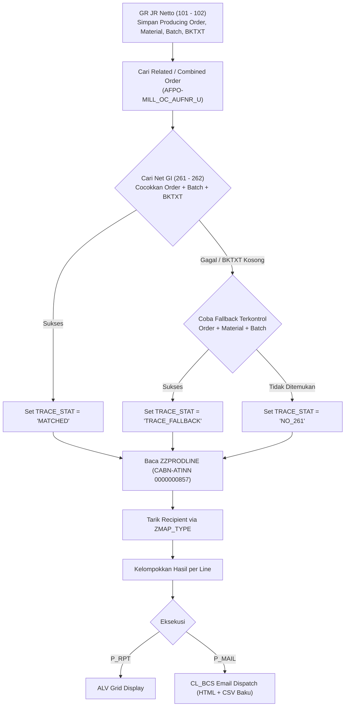

# ZPPR_GI_JR_CLOSING — Technical Design & Architecture

Program observasi closing modul PP (Production Planning) untuk mendeteksi anomali/exception Goods Issue (GI) Jumbo Roll terhadap Goods Receipt (GR).

Arsitektur menggabungkan pola terbaik dari:
- **`ZPPI_COHVPI`**: Pola seleksi order manufaktur, validasi status transaksional, dan eksekusi background job yang tangguh.
- **`ZMMI_PO_EMAIL`**: Pola manajemen ALV Variant (`REUSE_ALV_VARIANT_*`), isolasi layout ALV vs lampiran email baku, routing penerima via `ZMAP_TYPE`, dan dispatch email via `CL_BCS`.
- **`ZQMR_TRACEABILITY` & InfoSet `ORDER_MOVEMENT`**: Pola penelusuran rantai transaksi GR-GI, combined order, dan penanganan reversal.

---

## 1. Konteks Sistem & Penemuan Aktual (Ground Truth)

### 1.1 InfoSet & Program Referensi
- **InfoSet SQ01:** `ORDER_MOVEMENT` di bawah User Group `/KYK/IS_UG` (Deskripsi: *Process Order Movement*).
- **Program Referensi:** `ZQMR_TRACEABILITY`:
  - Menggunakan tabel `MSEG` dan `AUFM` untuk pergerakan material order.
  - Menggunakan field `MKPF-BKTXT` (Header Text) sebagai kunci penghubung utama antara dokumen GR dan GI dalam satu rangkaian proses eksekusi JR.
  - Menggunakan `AFPO-MILL_OC_AUFNR_U` untuk resolusi hirarki Combined / Parent Order (SAP Mill Products).
  - Movement Type Receipt: `101`, `102`, serta by-product waste `531`, `532`.
  - Movement Type Issue: `261`, `262`, serta custom movement `901`, `902`.

### 1.2 Penelusuran Reversal / Pembatalan (Storno) Mengikuti ZQM015
Untuk memastikan data kuantitas tidak terdistorsi oleh pembatalan parsial/penuh, pembatalan dilacak menggunakan mekanisme pair-matching dokumen referensi (`MSEG-SMBLN`, `SJAHR`, `SMBLP`) persis seperti implementasi `ZQM015` (`ZQMR_TRACEABILITY`):

```abap
" Salin tabel movement, buang dokumen non-storno
lt_mov_storno[] = gt_mov[].
DELETE lt_mov_storno WHERE smbln IS INITIAL.

" Loop storno dan hapus dokumen original yang direferensikan
LOOP AT lt_mov_storno INTO ls_mov.
  DELETE gt_mov WHERE mblnr = ls_mov-smbln
                  AND mjahr = ls_mov-sjahr
                  AND zeile = ls_mov-smblp.
ENDLOOP.

" Buang sisa dokumen storno
DELETE gt_mov WHERE smbln IS NOT INITIAL
                 OR bwart IN ('102', '532')     " untuk GR
                 OR bwart IN ('262', '902').    " untuk GI
```

Ditambah pengecekan pelengkap via `SELECT ... FROM MSEG FOR ALL ENTRIES` terhadap dokumen reversal yang mungkin diposting di luar periode cutoff seleksi.

### 1.3 Karakteristik Batch (Classification System)
- **`ZZPRODLINE`** (Production Line):
  - Internal Characteristic Number: `CABN-ATINN = 0000000857`.
  - Class Type: `023` (Batch).
  - Format: `CHAR`, panjang 2 karakter.
- **`ZZWEIGHTEL`** & Karakteristik Terkait:
  - Digunakan pada pencatatan waste movement `531`.
  - Komponen ekstra panjang (*Extra Length*) berasal dari Planning SR PPIC (umumnya ~1%).
  - Rekonsiliasi Manufaktur:
    $$\text{Waste Combine} = Qty_{GI\ JR} - Qty_{GR\ Slit\ Roll} - Qty_{Extra\ Length}$$
    *Contoh Nyata Manufaktur:*
    - GI JR: $1.771,45\text{ kg}$
    - GR Slit Roll: $1.693,50\text{ kg}$
    - Extra Length (1%): $14,84\text{ kg}$
    - Waste Combine: $1.771,45 - 1.693,50 - 14,84 = 63,11\text{ kg}$

---

## 2. Definisi Kriteria Observasi Bisnis

Program dioperasikan dalam satu executable report dengan tiga pilihan radio button:

```text
Kriteria Observasi Closing
  (•) Semua Anomali Closing                   [ R_ALL  ]
  ( ) Tidak Ada GI Sama Sekali                [ R_NOGI ]
  ( ) GI Kurang dari JR                       [ R_LESS ]
```

### 2.1 Mode 1: Semua Anomali (`R_ALL`) - Default
- **Kriteria:** Menampilkan seluruh anomali closing, baik batch yang belum ada GI sama sekali maupun yang kuantitas GI-nya kurang dari kuantitas JR.
- **Kalkulasi:** `cnt_261 = 0` ATAU `( cnt_261 > 0 AND qty_gi < qty_gr - p_tol )`.
- **Tujuan Bisnis:** Memberikan visibilitas menyeluruh bagi user closing dalam satu kali eksekusi tanpa perlu bolak-balik mengubah radio button.

### 2.2 Mode 2: Tidak Ada GI Sama Sekali (`R_NOGI`)
- **Kondisi:** Terdapat Goods Receipt (GR) Jumbo Roll efektif ($Net_{101-102} > 0$), namun **tidak ada Goods Issue (GI) 261 efektif** sampai batas tanggal cutoff (`cnt_261 = 0` / `qty_gi = 0`).
- **Logika Reversal:** Movement `262` harus mengurangi/membatalkan `261`. Jika hasil netto konsumsi $= 0$ atau nihil record 261, maka masuk kategori ini.
- **Tujuan Bisnis:** Menghasilkan daftar Jumbo Roll yang sudah selesai diproduksi namun belum pernah dipotong bahan bakunya di sistem (potensi unconsumed inventory).

### 2.3 Mode 3: GI Kurang dari JR (`R_LESS`)
- **Kondisi:** GI efektif lebih dari nol ($Net_{261-262} > 0$), namun total kuantitas GI masih di bawah kuantitas JR di luar batas toleransi.
- **Kalkulasi:** `cnt_261 > 0 AND qty_gi < ( qty_gr - p_tol )`.
- **Tujuan Bisnis:** Memfokuskan verifikasi pada order dengan potensi under-consumption (kekurangan potong bahan baku).
*(Catatan: Mode arbitrer selisih mutlak GI vs GR dihapus karena kondisi $GI > GR$ merupakan hal wajar akibat waste/trim pada industri roll).*

---

## 3. Arsitektur Tracing & Penanganan Fallback

### 3.1 Struktur Penampung Relasi Order (`TY_ORDER_LINK`)
Untuk menangani pencocokan multi-kriteria secara akurat, penampung relasi antar order tidak hanya menyimpan `AUFNR`, melainkan struktur lengkap:

```abap
TYPES: BEGIN OF ty_order_link,
         source_aufnr TYPE aufnr,    " Producing Order
         target_aufnr TYPE aufnr,    " Consuming Order / Movement Order
         matnr        TYPE matnr,    " Material Number
         charg        TYPE charg_d,  " Batch Number
         bktxt        TYPE bktxt,    " Header Text Dokumen
       END OF ty_order_link.
```

### 3.2 Kunci Pencocokan (Multi-Key Matching)
Pencocokan antara dokumen penerimaan (GR) dan pemakaian (GI) tidak boleh hanya mengandalkan `AUFNR` tunggal, melainkan kombinasi:
1. `Material` (`MATNR`)
2. `Batch` (`CHARG`)
3. `Related Order` (via `AFPO-MILL_OC_AUFNR_U`)
4. `Header Text` (`MKPF-BKTXT`)
5. `Plant` (`WERKS`)
6. `Posting Cutoff` (`BUDAT`)
7. `Reversal Reference` (`SMBLN`, `SJAHR`, `SMBLP`)

### 3.3 Logika Fallback Terkontrol (`TRACE_FALLBACK`)
- **Masalah:** Praktik di lapangan menunjukkan bahwa field `MKPF-BKTXT` dapat kosong atau diisi tidak konsisten oleh user/interface MES.
- **Solusi:** Jika pencocokan via `MKPF-BKTXT` gagal, sistem beralih ke **fallback terkontrol** menggunakan kombinasi:
  $$\text{MATNR} + \text{CHARG} + \text{Related Order}$$
- **Status Penelusuran (Human-Readable):**
  - `'Cocok via BKTXT'` (sebelumnya `MATCHED`): Berhasil dicocokkan langsung via Header Text `MKPF-BKTXT`.
  - `'Cocok via Batch'` (sebelumnya `TRACE_FALLBACK`): Berhasil dicocokkan melalui fallback `MATNR + CHARG + Order`.
  - `'Belum Ada GI 261'` (sebelumnya `NO_261`): JR sudah GR tapi belum ada pergerakan pemakaian/GI 261 sama sekali.
  - `'BKTXT Kosong (Belum GI)'` (sebelumnya `BKTXT_EMPTY`): Dokumen GR tanpa BKTXT dan belum ada konsumsi GI.



---

## 4. Konfigurasi `ZMAP_TYPE` (TCODE `SM30`)

Struktur tabel kustom `ZMAP_TYPE`:
- **Primary Key:** `TCODE + PROG + TYPE + OPT + VALUE`
- **Payload:** `TEXT1`, `TEXT2`, `TEXT3`, `TEXT4`, `TEXT5`
- **Flag Aktif:** `DELETION` (Kosong = Aktif, `'X'` = Dihapus logis)

> **Catatan Desain:** Sesuai keputusan bisnis, pemetaan `PRODLINE` ditiadakan dari `ZMAP_TYPE`. Program langsung mengonsumsi nilai karakteristik batch `ZZPRODLINE` (`AUSP-ATWRT`) sebagai kode Production Line (`PRODLINE`). Konfigurasi `ZMAP_TYPE` difokuskan **murni untuk `EMAIL_RECIPIENT`**.

### 4.1 Pemetaan Penerima Email (`TYPE = EMAIL_RECIPIENT`)
Mendukung banyak penerima (`Multiple TO / CC / BCC`) untuk setiap production line:

```text
PROG  = ZPPR_GI_JR_CLOSING
TYPE  = EMAIL_RECIPIENT
OPT   = 4                       <-- Nilai karakteristik batch ZZPRODLINE (atau 'DEFAULT')
VALUE = 001                     <-- Urutan nomor urut recipient
TEXT1 = spv.line4               <-- Username atau prefix email
TEXT2 = @trst.co.id             <-- Domain email
TEXT3 = TO                      <-- Role: TO / CC / BCC
TEXT4 = Supervisor Line 4       <-- Keterangan / PIC
TEXT5 = spv.line4@trst.co.id    <-- Alamat email utuh (opsional override)
```

- **Ketentuan Format:**
  - `TEXT5`: Alamat email utuh (*full email override*). Jika `TEXT5` terisi alamat email lengkap (mengandung karakter `@`), program mengabaikan gabungan `TEXT1 + TEXT2`.
  - Fallback Line: Jika suatu line produksi tidak memiliki konfigurasi di `ZMAP_TYPE`, sistem mencari entri dengan `OPT = 'DEFAULT'`.

### 4.2 Konfigurasi Aktif di Sistem TRS (10 Records Terdaftar)

Tabel `ZMAP_TYPE` di SAP TRS terisi 10 entri aktif untuk routing email:

| TYPE | OPT (Line) | VALUE | Email (TEXT1/TEXT5) | Role (TEXT3) | Keterangan (TEXT4) |
|---|---|---|---|---|---|
| `EMAIL_RECIPIENT` | `DEFAULT` | `001` | `sap.pp@trst.co.id` | `TO` | PP Dept |
| `EMAIL_RECIPIENT` | `DEFAULT` | `002` | `pp.admin@trst.co.id` | `CC` | Admin PP |
| `EMAIL_RECIPIENT` | `4` | `001` | `spv.line4@trst.co.id` | `TO` | SPV Line 4 |
| `EMAIL_RECIPIENT` | `4` | `002` | `sap.pp@trst.co.id` | `CC` | PP Dept |
| `EMAIL_RECIPIENT` | `Z3` | `001` | `spv.z3@trst.co.id` | `TO` | SPV Line Z3 |
| `EMAIL_RECIPIENT` | `Z3` | `002` | `sap.pp@trst.co.id` | `CC` | PP Dept |
| `EMAIL_RECIPIENT` | `1` | `001` | `spv.line1@trst.co.id` | `TO` | SPV Line 1 |
| `EMAIL_RECIPIENT` | `2` | `001` | `spv.line2@trst.co.id` | `TO` | SPV Line 2 |
| `EMAIL_RECIPIENT` | `3` | `001` | `spv.line3@trst.co.id` | `TO` | SPV Line 3 |
| `EMAIL_RECIPIENT` | `5` | `001` | `spv.line5@trst.co.id` | `TO` | SPV Line 5 |

*Catatan: Konfigurasi ini dapat disesuaikan kembali sewaktu-waktu oleh user melalui TCODE `SM30` tabel `ZMAP_TYPE`.*

---

## 5. Selection Screen & Perilaku Eksekusi Dinamis

### 5.1 Parameter & Kontrol Layar
- **Blok Mode Eksekusi:** `P_RPT` (Report ALV) & `P_MAIL` (Send Email).
- **Blok Kriteria Observasi Closing:** `R_ALL` (Default), `R_NOGI`, `R_LESS`.
- **Blok Parameter Seleksi:** `S_WERKS`, `S_BUDAT`, `S_LINE`, `S_AUFNR`, `P_TOL` (Default `0.001`), `P_VARI` (ALV Layout Variant).
- **Blok Pengaturan Email:** `P_TEST` (Test Run, Default `'X'`), `P_TMAIL` (Test Send Email), `P_TADDR` (Test Recipient).

### 5.2 Matriks Perilaku Screen (`AT SELECTION-SCREEN OUTPUT`)

| Mode | Varian ALV (`P_VARI`) | Blok Email | Test Recipient (`P_TADDR`) | Tindakan Dispatch `CL_BCS` |
|---|---|---|---|---|
| **Report (`P_RPT`)** | Tampil / Aktif | Sembunyi | Non-aktif | Tidak kirim email. Render ALV Grid. |
| **Send Email + Test Run** (`P_MAIL` + `P_TEST`) | Sembunyi | Tampil (`P_TEST = X`) | Non-aktif | Hitung data, grouping per line, buat body & attachment, siapkan recipient. **Tidak panggil `CL_BCS->SEND`.** Aman untuk batch job baru. |
| **Send Email + Test Send** (`P_MAIL` + `P_TMAIL`) | Sembunyi | Tampil (`P_TMAIL = X`) | **Wajib Diisi** | Kirim aktual via `CL_BCS`. Abaikan daftar recipient line; **kirim hanya ke `P_TADDR`** dengan subject `[TEST] ...`. |
| **Send Email Normal** (`P_MAIL` live) | Sembunyi | Tampil (Checkbox kosong) | Non-aktif | Kirim aktual ke seluruh `TO`/`CC`/`BCC` dari `ZMAP_TYPE` per production line. |

---

## 6. Standar ALV Layout & Format Email

Mengikuti pola baku `ZMMI_PO_EMAIL`:
- ALV Layout Variant dikelola via `REUSE_ALV_VARIANT_DEFAULT_GET`, `REUSE_ALV_VARIANT_F4`, `REUSE_ALV_VARIANT_EXISTENCE`.
- **Pemisahan Tegas:** Layout ALV hanya mengatur preferensi tampilan GUI user. Lampiran email (`CSV`) **wajib menggunakan kolom tetap/baku** agar hasil proses otomatis tidak terpengaruh varian user.

### Susunan 19 Kolom Baku (Fixed Schema):
1. `STATUS_OBS` : Status Observasi (`GI JR TIDAK ADA 261`, `SELISIH DI ATAS TOLERANSI`, `GI KURANG DARI GR`)
2. `WERKS` : Plant
3. `PRODLINE` : Production Line (Hasil normalisasi)
4. `JR_NUMBER` : Nomor fisik roll (Karakteristik `ZZNOMORROLL` / Batch)
5. `MATNR` : Kode Material
6. `MAKTX` : Deskripsi Material
7. `GR_DATE` : Tanggal posting GR pertama
8. `AUFNR` : Producing Order (Order pembuat JR)
9. `MOV_ORDER` : Consuming Order (Order pemakai konsumsi)
10. `CHARG` : Nomor Batch
11. `BKTXT` : Header Text Dokumen Material
12. `QTY_GR` : Kuantitas Netto GR
13. `QTY_GI` : Kuantitas Netto GI
14. `QTY_DIFF` : Selisih Kuantitas ($Qty_{GR} - Qty_{GI}$)
15. `MEINS` : Satuan Ukuran (UoM)
16. `AUART` : Order Type
17. `VERID` : Production Version
18. `TRACE_STAT` : Status Penelusuran (`Belum Ada GI 261`, `Cocok via BKTXT`, `Cocok via Batch`, `BKTXT Kosong (Belum GI)`)
19. `MAIL_STATUS` : Status Email Dispatch (`EMAIL_SENT`, `TEST_RUN_PREVIEW`, `NO_TO_RECIPIENT`, `EMAIL_ERROR`)
